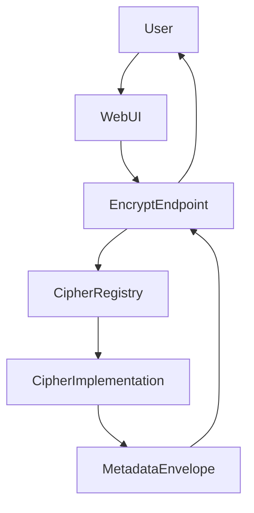

# Architecture

## Overview

Crypto Lab is layered so the web layer stays thin and all crypto logic lives in core and cipher modules.

- **Web** (`crypto_lab/web`): FastAPI app, routers for encrypt/decrypt/algorithms, key generation, and optional static/template serving.
- **Core** (`crypto_lab/core`): Base cipher interface, registry, metadata helpers, and serialization (text JSON envelope, file binary envelope).
- **Ciphers** (`crypto_lab/classical`, `crypto_lab/modern`): Concrete implementations; each registers itself with the registry on import.
- **Models** (`crypto_lab/models`): Enums (classification, family, strength, data type) and payload/metadata models.

## Data flow

- **Encrypt (text)**  
  Request (algorithm_id, plaintext, key or password) → resolve key (optional KDF) → get cipher from registry → `encrypt_bytes` → build metadata → serialize to JSON envelope → response.

- **Decrypt (text)**  
  Request (envelope JSON, key or password) → deserialize envelope → read alg_id and metadata → resolve key (use salt/iterations from metadata if password) → get cipher → `decrypt_bytes` → response.

- **File**  
  Same flow; file content is encrypted/decrypted as bytes. File format: magic header, 4-byte big-endian length of JSON metadata, JSON metadata, raw ciphertext.

## Tradeoffs

- **In-memory only (V1)**: Keys and plaintexts are not persisted; suitable for a demo/playground.
- **Single process**: No distributed key store; scaling would require external key management.
- **Light persistence**: Only non-secret config and metadata are intended for persistence (e.g. algorithm lists, envelope metadata).
